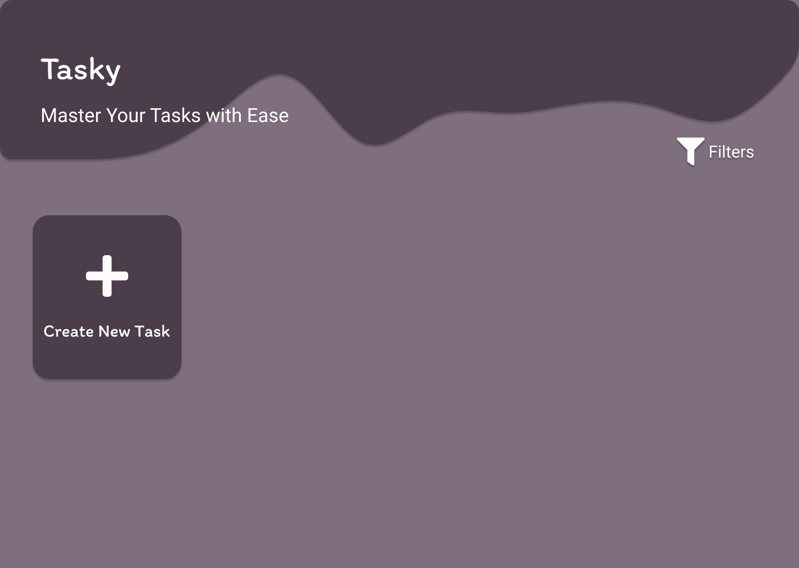
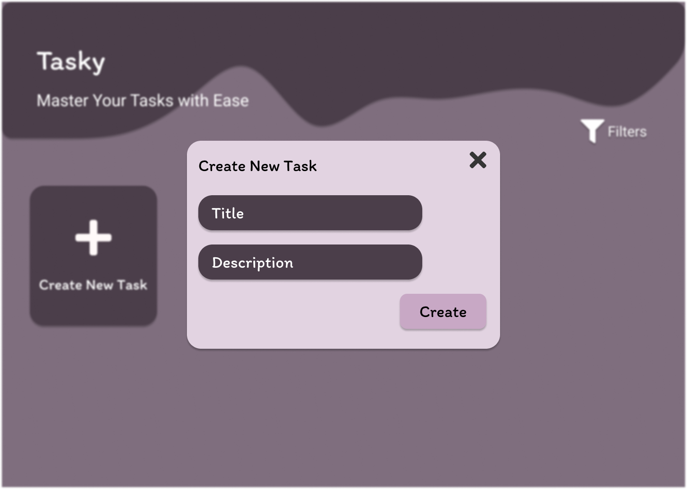
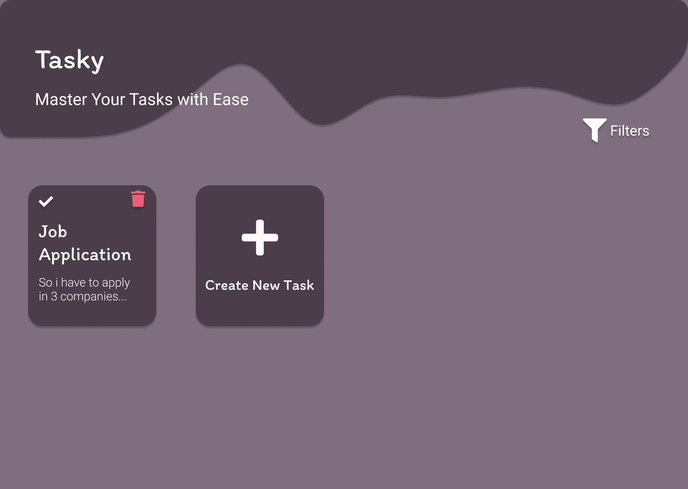
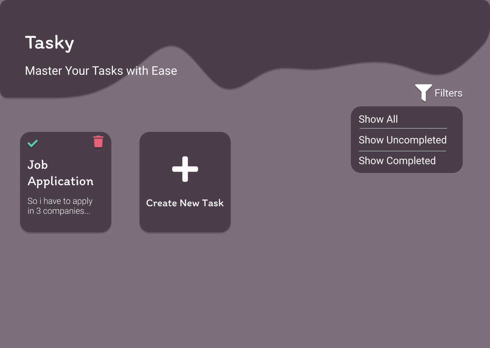
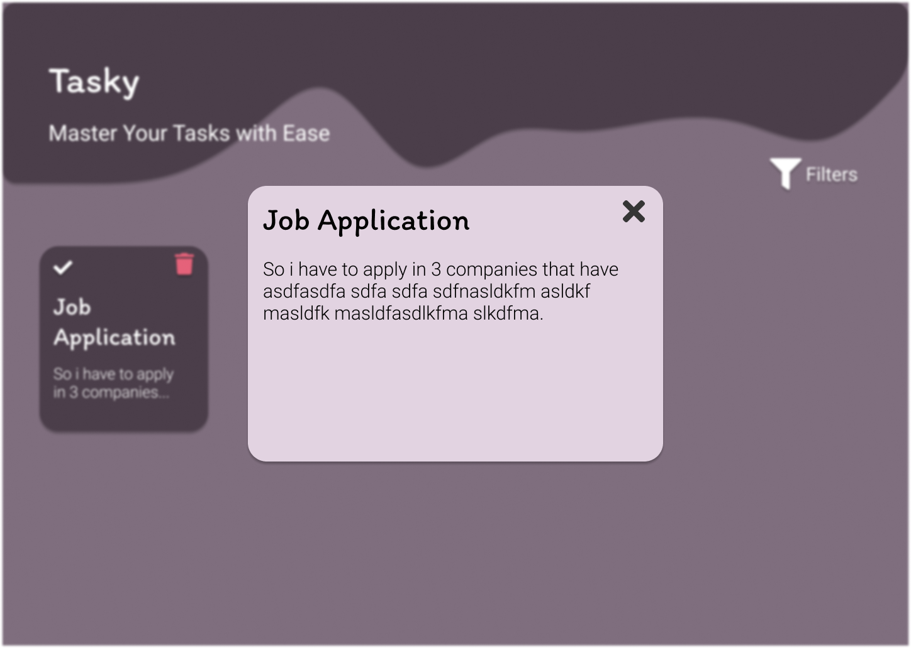

# MainSys
MainSys Project
# Tasky

A Comprehensive Task Management Application

## Description

Tasky is an intuitive and user-friendly task management application designed to help users efficiently manage their daily tasks. With Tasky, users can effortlessly add, edit, delete, and manage their tasks, ensuring they stay organized and productive. The application features a robust set of functionalities to enhance the user experience, including the ability to mark tasks as completed and filter tasks based on their completion status.

## Overview

Our application empowers users to effortlessly organize their shopping experiences by providing comprehensive insights into their household needs. It intelligently identifies products that require replenishment across different areas of the house, such as the kitchen and bathroom, while offering a curated smart list featuring real-time price updates from local vendors. Users can conveniently track purchased items and allocate them to designated spaces, such as the fridge, enhancing overall household efficiency. Moreover, the application offers an extensive library of recipes tailored to the ingredients available in the kitchen, inspiring culinary creativity and minimizing food waste. Additionally, users can stay informed about exclusive offers and monitor the status of household products, ensuring timely restocking and optimal utilization.

## Key Features:

* **Add New Tasks**: Users can easily create new tasks by providing a title and description, ensuring all necessary details are captured.
* **Edit Existing Tasks**: Flexibility to modify task details to keep information current and accurate.
* **Delete Tasks**: Remove tasks that are no longer relevant with a simple delete option.
* **Mark Tasks as Completed**: Users can mark tasks as completed or revert them to incomplete status as needed.
* **Filter Tasks**: View tasks based on their status with filters to show all tasks, only completed tasks, or only incomplete tasks.
## Screenshots

|  |  |  |
|:---:|:---:|:---:|
| Initialize the app | Search | Maps | 

|  |  |
|:---:|:---:|
| Initialize the app | Search |
